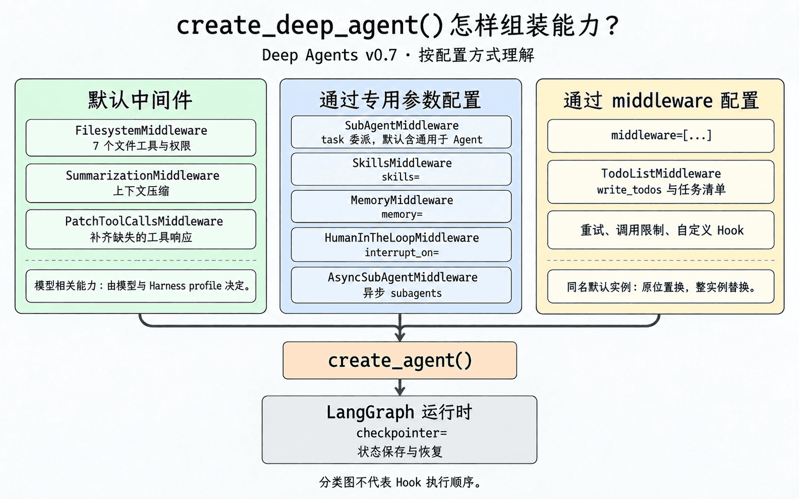
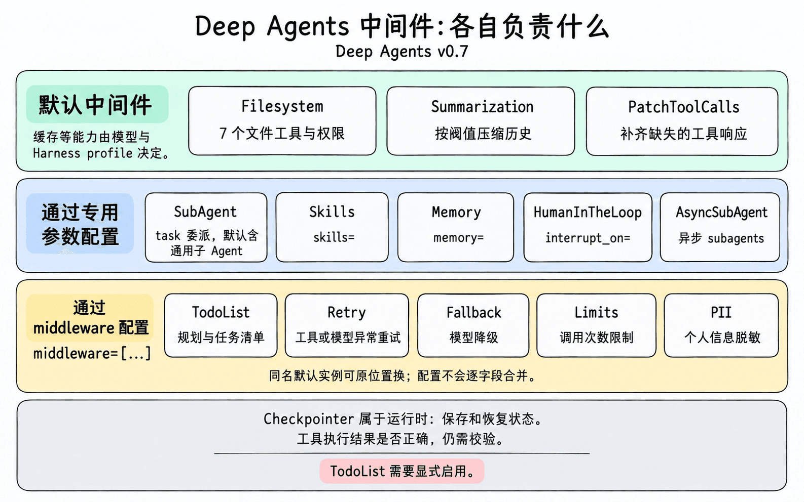

# 第 4 章：任务规划与分解 — 让 Agent 学会拆解复杂任务

> 上一章我们学习了虚拟文件系统如何管理 Agent 的上下文。本章聚焦另一个核心能力——任务规划。`write_todos` 可以帮助 Agent 拆解任务、追踪进度；从 v0.7 开始，这项能力按需启用，不再是每个 Agent 的固定配置。

## 为什么 Agent 需要"规划"能力？

### 简单任务 vs 复杂任务

对于简单任务，Agent 可以一步到位：

```
用户：北京今天天气怎么样？
Agent：[调用天气工具] → 今天北京晴，25°C。
```

复杂任务通常需要多步执行。例如：

```
用户：帮我调研 LangGraph 的技术架构，对比三个竞品，写一份 3000 字的分析报告。
```

这个任务涉及：搜索多个信息源、阅读和整理大量资料、对比分析、组织结构、撰写报告。缺少明确的任务清单时，Agent 更容易遗漏步骤或重复搜索。规划可以帮助它追踪进度，具体效果仍要通过实际任务验证。

### 没有规划的 Agent 会怎样？

- **遗漏关键步骤**：直接开始写报告，忘了先搜索竞品信息
- **重复劳动**：搜索了同一个关键词三次，因为它"忘记"已经搜过了
- **半途而废**：上下文太长后，Agent 失去了对整体进度的把控
- **质量不稳定**：有时做得很好，有时莫名跳过重要环节

规划能力让 Agent 能够**先思考再行动**——把大任务拆解为小步骤，然后逐步执行、追踪进度、动态调整。

## 在 v0.7 中显式启用任务规划

`TodoListMiddleware` 会同时注入 `write_todos` 工具、`todos` 状态和规划提示词。v0.7 默认不再安装它，需要时应明确传入：

> **示意片段**：`model` 代表已配置好的聊天模型；模型初始化方式见第 2 章，本章后面的完整示例也包含这部分配置。

```python
from deepagents import create_deep_agent
from langchain.agents.middleware import TodoListMiddleware

agent = create_deep_agent(
    model=model,
    middleware=[TodoListMiddleware()],
)
```

是否启用，应由任务和产品需求决定：

| 场景 | 建议 |
|---|---|
| 单步问答、短工具调用 | 保持关闭，避免计划比任务本身还长 |
| 长程、多阶段、容易漏步骤的任务 | 启用，并用真实任务检查完成率和轨迹长度 |
| 能力较弱、容易失去主线的模型 | 先做 A/B 评测，通常值得尝试 |
| UI 需要展示计划、当前步骤和进度 | 启用；此时 `todos` 也是产品状态协议 |

## `write_todos` 工具详解

启用后，Deep Agents 会获得 `write_todos` 工具，让 Agent 可以创建和管理任务清单。工具存在不代表每个任务都会调用；具体行为仍由模型、提示词和任务复杂度共同决定。

### 任务的数据结构

每个任务包含以下字段：

```python
{
    "content": "搜索 LangGraph 官方文档，整理核心架构和 API 设计",  # 任务内容
    "status": "pending"  # 状态
}
```

### 三种状态

| 状态 | 含义 | 典型场景 |
|---|---|---|
| `pending` | 待办 | Agent 刚规划出来，还没开始做 |
| `in_progress` | 进行中 | Agent 正在执行这个步骤 |
| `completed` | 已完成 | Agent 将任务标记为完成 |

常见状态流转：`pending` → `in_progress` → `completed`。模型也可以根据新信息调整清单，这不是框架强制执行的流程。

`completed` 是 Agent 写入的进度标记。应用仍需检查产物：例如报告是否生成、引用能否核实，或修改后的代码是否通过测试。仅看清单全部完成，不能判断任务质量。

### Agent 怎么用 write_todos？

当 Agent 收到一个复杂任务时，它的典型行为是：

**第一步：制定计划**

```
Agent 思考：这个任务比较复杂，我先拆解一下。
Agent 调用 write_todos：
  1. [pending] 搜索 LangGraph 官方文档和核心概念
  2. [pending] 搜索三个竞品（Temporal、Inngest、Prefect）
  3. [pending] 对比分析各产品的优劣势
  4. [pending] 撰写报告大纲
  5. [pending] 撰写完整报告
```

**第二步：逐步执行**

```
Agent 更新任务 1 状态为 in_progress
Agent 调用 internet_search("LangGraph architecture")
Agent 调用 write_file("/workspace/langgraph_notes.md", ...)
Agent 更新任务 1 状态为 completed

Agent 更新任务 2 状态为 in_progress
Agent 调用 internet_search("Temporal vs LangGraph")
...
```

**第三步：动态调整**

在执行过程中，Agent 可能发现需要额外的步骤：

```
Agent 思考：搜索时发现 Prefect 不太合适，应该换成 Durable Objects。
Agent 调用 write_todos 更新列表：
  1. [completed] 搜索 LangGraph 官方文档和核心概念
  2. [in_progress] 搜索三个竞品
  3. [pending] 对比分析各产品的优劣势
  4. [pending] 撰写报告大纲
  5. [pending] 撰写完整报告
  6. [pending] 补充 Durable Objects 的资料 ← 新增
```


> [!NOTE]
> **v0.7 提醒**：这张图描述的是已启用 `TodoListMiddleware` 后的典型流程。默认配置中没有 `write_todos`；即使已经启用，图中的步骤也是可用工作方式，不是框架强制执行的状态机。

### 任务清单的持久化

任务清单保存在 **Agent State 的 `todos` 字段**中，和消息历史分开管理：

- 同一次运行中，后续步骤可以继续访问这份清单；默认的对话总结不会删除 `todos` 字段
- 多次 `invoke()` 之间要自动接续清单，需要配置 Checkpointer，并复用同一个 `thread_id`；只添加 `TodoListMiddleware` 不会自动接续上次运行的状态
- `InMemorySaver` 只在当前进程中保存检查点；进程重启后还要恢复，需要使用数据库等持久化 Checkpointer。部署到 Agent Server 时，由平台提供相应的持久化能力
- 默认 `general-purpose` 子 Agent 会继承主 Agent 显式传入的 Todo 配置，但仍在自己的状态中维护清单
- `subagents=[...]` 声明的子 Agent 有独立 Middleware 栈，需要规划能力时必须在自己的 spec 中启用 Todo；它也不会读取主 Agent 的清单

Checkpointer 的配置方式见[第 8 章：短期记忆的基础](../ch08-long-term-memory/#checkpointer短期记忆的基础)。

## 揭开引擎盖：LangChain 中间件

到目前为止，我们一直从 Deep Agents 的视角看 `write_todos`。如果你想理解它为什么可以按需加入，以及如何扩展，就需要揭开引擎盖，看看底层的 LangChain 中间件机制。

还记得第 1 章的三层架构吗？Deep Agents（Harness）构建在 LangChain（Framework）之上。而 LangChain 提供了一套<strong>中间件（Middleware）</strong>系统——它是 Agent 能力的插件机制。`create_deep_agent()` 内部做的事情，本质上就是把一组中间件**自动组装**到了 Agent 上。

### 先分清两类 Hook

LangChain 中间件提供两类执行边界。它们都叫 Hook，但适合解决的问题并不相同：

| 风格 | Hook | 执行方式 | 适合场景 |
|---|---|---|---|
| **Node-style** | `before_agent`、`before_model`、`after_model`、`after_agent` | 编译成 Agent 图中的独立节点，按生命周期顺序运行 | 校验、状态更新、审计、人工中断 |
| **Wrap-style** | `wrap_model_call`、`wrap_tool_call` | 包裹一次模型或工具调用；可以不调用、调用一次或多次 `handler` | 重试、缓存、降级、请求或响应转换 |

这个区别对 `interrupt()` 尤其重要：Node-style Hook 有清晰的图节点边界，暂停与恢复时更容易推断哪些逻辑会重放；Wrap-style Hook 位于 model/tools 节点内部，恢复时可能连同 `handler` 一起重新执行。因此自定义人工中断优先放在 Node-style Hook 中，Wrap-style 即使技术上可以调用，也不适合作为默认中断边界。

第 9 章会用一个完整例子展示[如何在自定义 Middleware 的 Node-style Hook 中直接调用 `interrupt()`](../ch09-human-in-the-loop/#在自定义-middleware-中使用-interrupt)。

在 v0.7 中，可以按配置方式理解 `create_deep_agent()` 组装的中间件。下面三组说明能力从哪里加入，不代表三个执行层级：

**默认中间件**：
- `FilesystemMiddleware` — 注入 7 个文件工具，并执行 `permissions` 权限规则
- `SummarizationMiddleware` — 上下文自动压缩，触发阈值可配置
- `PatchToolCallsMiddleware` — 补齐消息历史中缺失的工具响应
- Prompt caching 等模型相关能力 — 是否启用取决于模型和 Harness profile

**通过专用参数配置**：`skills=`、`memory=`、`interrupt_on=` 等参数用于配置相应能力，由 Deep Agents 组装对应的中间件。
- `SubAgentMiddleware` — 由 `subagents=` 配置，默认包含 `general-purpose` 子 Agent；提供 `task` 工具
- `SkillsMiddleware` — 传入 `skills=` 参数时启用，注入技能包
- `AsyncSubAgentMiddleware` — 传入异步子 Agent 时启用
- `MemoryMiddleware` — 传入 `memory=` 参数时启用，注入 AGENTS.md 记忆
- `HumanInTheLoopMiddleware` — 传入 `interrupt_on=` 参数时启用，拦截指定工具调用等待人工审批

**通过 `middleware` 配置**（传入 `middleware=[...]`）：
- `TodoListMiddleware` 等可选策略可以按需加入
- 与默认 Middleware 同名的实例会在原位置换默认实例，而不是在末尾再叠加一个
- 原位置换是完整实例替换，不会把新旧配置按字段合并

理解这些配置方式，你就能：
- 看懂 Deep Agents 内部是怎么拼装出来的
- 自己按需添加新能力（PII 脱敏、模型降级、调用次数限制……）
- 在更底层的 LangChain `create_agent()` 上搭建定制化的 Agent

其中 `FilesystemMiddleware` 的路径授权不需要另写自定义中间件；`permissions=` 的规则模型、默认允许语义与适用边界见[第 11 章：文件系统权限](../ch11-filesystem-permissions/)。



图中按配置方式分类，连线不代表 Hook 的执行顺序。具体的调用顺序取决于 Hook 类型和中间件在栈中的位置。

### PatchToolCallsMiddleware：补齐哪一种“缺口”？

模型发出工具调用后，消息历史通常还需要一条对应的工具响应。例如，模型请求搜索资料，工具执行后返回搜索结果。响应中的 `tool_call_id` 指向请求中的调用 ID，把两条消息关联起来。

如果这次运行在工具响应写回前被取消，历史里可能只剩下调用请求。下一次 Agent 运行开始前，`PatchToolCallsMiddleware` 会在 `before_agent` Hook 中检查历史，为缺失的响应补上一条 `ToolMessage`，说明这次调用被取消；对于参数损坏或截断的调用，则说明它未能执行。

假设 Agent 准备搜索 LangGraph 的资料：

1. **发起调用**：模型请求执行 `internet_search("LangGraph")`，调用 ID 为 `call_1`。
2. **运行被取消**：工具响应还没写回，消息历史里缺少 `call_1` 对应的响应。
3. **补齐响应**：下一次 Agent 运行开始前，`PatchToolCallsMiddleware` 补上一条 `tool_call_id` 为 `call_1` 的 `ToolMessage`，说明上次调用已取消。

它补齐的是消息记录，不会重新执行搜索，也不会把错误结果改成正确结果。已经有对应工具响应的调用，即使返回的是错误信息，也不属于这种缺口。补上的取消说明也不能证明外部操作已撤销，例如服务端可能已经处理了请求，只是客户端没有拿到结果。

这几个职责很容易混在一起，可以按遇到的问题来区分：

| 遇到什么情况 | 谁来处理 | 需要注意什么 |
|---|---|---|
| 历史里有工具调用，却缺少对应响应 | `PatchToolCallsMiddleware` 补充说明消息 | 不重试工具，不验证结果是否正确 |
| 工具调用遇到可重试的异常 | 应用显式配置的 `ToolRetryMiddleware` | 是否重试、重试次数由策略决定；写操作还要考虑重复执行 |
| 下一次运行继续上一次的状态 | Checkpointer 配合同一个 `thread_id` | 跨进程恢复需要持久化 Checkpointer |
| 工具返回了内容，但内容是否正确 | 应用的校验、评测或人工审核 | 调用成功、清单完成都不等于结果正确 |

**Checkpointer 属于 LangGraph 的运行时持久化机制**，通过 `checkpointer=` 配置，不是 `middleware=[...]` 中的一项。恢复也不是回到任意一行代码继续执行：例如 `interrupt()` 恢复时会从当前节点开头重放，因此有副作用的操作需要考虑幂等性。具体规则见[第 9 章：interrupt() 的使用规则](../ch09-human-in-the-loop/#interrupt-的使用规则)。

本节的消息修补行为按 [Deep Agents 0.7.10 的实现](https://github.com/langchain-ai/deepagents/blob/deepagents%3D%3D0.7.10/libs/deepagents/deepagents/middleware/patch_tool_calls.py)核对。

### TodoListMiddleware：write_todos 的真身

`write_todos` 的底层实现是 LangChain 的 `TodoListMiddleware`。无论使用 Deep Agents 的 `create_deep_agent()`，还是更底层的 `create_agent()`，v0.7 都需要显式添加这项能力。下面展示 LangChain 层的手动组合：

> **示意片段**：下面聚焦中间件组装，因此不注册额外的应用工具；运行前需要安装示例中的包并配置 `SILICONFLOW_API_KEY`。

```python
import os
from langchain_openai import ChatOpenAI
from langchain.agents import create_agent
from langchain.agents.middleware import TodoListMiddleware
from deepagents.middleware import FilesystemMiddleware

model = ChatOpenAI(
    # 任务规划属于复杂推理场景，建议使用能力较强、支持工具调用的模型
    model="zai-org/GLM-5.2",
    api_key=os.environ["SILICONFLOW_API_KEY"],
    base_url="https://api.siliconflow.cn/v1",
)

agent = create_agent(
    model=model,
    tools=[],
    middleware=[
        TodoListMiddleware(),
        FilesystemMiddleware(),   # 自动注入 read_file / write_file 等文件工具
    ],
)
```

添加 `TodoListMiddleware` 后，Agent 会自动获得：

1. **`write_todos` 工具** — 创建和管理任务清单
2. **`todos` 状态** — 保存任务及其状态，供后续步骤和 UI 使用；跨次调用的接续由 Checkpointer 负责
3. **规划指导提示词** — 引导 Agent 在面对复杂任务时先规划再执行

这段代码展示了 LangChain `create_agent()` 的用法。Deep Agents 会提供文件系统、上下文管理和子 Agent 等 Harness 默认能力，但 Todo 仍由应用选择。

### 自定义配置

`TodoListMiddleware` 支持两个可选参数：

```python
TodoListMiddleware(
    system_prompt="...",      # 自定义规划指导提示词
    tool_description="...",   # 自定义 write_todos 工具的描述
)
```

大多数情况下，默认配置就够了。只有当你发现 Agent 的规划行为需要特别引导时（比如"总是先写测试再写代码"），才需要自定义 `system_prompt`。

### SummarizationMiddleware：上下文压缩的真身

第 3 章讲的“对话历史自动总结”，由 Deep Agents 的 `SummarizationMiddleware` 负责。LangChain 也有一个同名中间件，Deep Agents 复用了它的摘要逻辑，但两者的执行位置和消息处理方式不同。

| 对比项 | LangChain 版本 | Deep Agents 版本 |
|---|---|---|
| 导入位置 | `langchain.agents.middleware` | `deepagents.middleware` |
| 执行位置 | `before_model` / `abefore_model`，在图中形成独立节点 | `wrap_model_call` / `awrap_model_call`，在 `model` 节点内部执行 |
| 正常摘要后的消息 | 将当前 `state["messages"]` 中的旧消息替换为摘要，保留近期消息 | 保留原始消息，另外记录摘要和截断位置；本次模型输入使用“摘要 + 近期消息” |
| 历史保存 | 不负责将旧消息写入 Backend | 将待总结的旧消息写入 Backend，摘要中附上保存路径 |

因此，用 `agent.get_graph()` 查看结构时，LangChain 版本会出现 `SummarizationMiddleware.before_model` 节点；Deep Agents 版本的摘要逻辑位于 `model` 节点内部，不会单独出现摘要节点。图展示的是节点结构，不会把节点内部的包装逻辑全部展开。

Deep Agents 需要在长任务中压缩模型输入，同时保留历史供后续查阅。它通过 `request.override(messages=...)` 调整本次请求，并将摘要记录在单独的状态字段中；这不等于只注入工具和提示词。需要按路径读回历史时，还要配置使用同一 Backend 的 `FilesystemMiddleware`。提供 `compact_conversation` 工具的则是另一个 `SummarizationToolMiddleware`，与这里的自动摘要分开配置。

**手动实例化时要设置 `trigger`。** 两个同名类的默认值都是 `None`，不会按阈值主动摘要。`create_deep_agent()` 会为默认摘要中间件选择触发条件；直接用 `create_agent(middleware=[...])` 组装时，不会自动获得这组默认配置。图中是否有摘要节点，也不能证明摘要已经触发。

想观察摘要，可以给两者都设置 `trigger=("messages", 4)`、`keep=("messages", 2)`，传入几轮消息后调用 Agent，再比较模型实际收到的消息。这里的两个数字只用于小规模演示；实际任务应按上下文大小和信息保留需求设置。

以上按 [Deep Agents 0.7.10 的实现](https://github.com/langchain-ai/deepagents/blob/deepagents%3D%3D0.7.10/libs/deepagents/deepagents/middleware/summarization.py)核对。Deep Agents 还会在模型调用抛出 `ContextOverflowError` 时尝试摘要后重试；这种溢出处理和按 `trigger` 主动摘要是两条触发路径。

## 任务规划与上下文管理的协同

在长时间运行的任务中，任务规划和上下文管理需要**协同工作**。

### 问题场景

假设 Agent 正在执行一个包含 10 个步骤的研究任务。执行到第 6 步时，对话历史已经非常长了——前面 5 步的搜索结果、文件读写操作、中间思考过程全部堆在上下文里。

此时，Deep Agents 的上下文管理机制（第 3 章）会自动介入：

1. **大结果卸载**：前面步骤产生的大量搜索结果已经被卸载到文件系统
2. **对话总结**：如果上下文仍然超过配置的触发阈值，旧消息会被总结，本次模型输入改为摘要加近期消息。`create_deep_agent()` 在已知模型窗口大小时默认使用 85%；缺少该信息时使用固定 token 阈值，也可以通过 `trigger` 自定义

### 任务清单的锚定作用

关键点在于：**默认的对话总结压缩发给模型的消息，不会删除单独保存的 `todos` 字段**。

这份清单可以帮助 Agent 在总结后继续追踪：

- 总共有哪些步骤
- 哪些已经完成，哪些还在进行
- 下一步该做什么

清单是否及时更新、下一步是否合理，仍取决于模型的实际行为。调试时要把 `todos` 和工具调用记录、最终产物放在一起看，不能只看进度标记。

### 在 LangChain 中手动组合

下面用 LangChain 的 `create_agent()` 手动组合任务规划、文件工具和 Deep Agents 的摘要中间件。文件工具和摘要中间件使用同一个 Backend，这样摘要里保存的历史路径才能通过 `read_file` 读回。

> **示意片段**：复用上一个示例定义的 `model`，并省略与中间件组合无关的自定义工具。

```python
from langchain.agents import create_agent
from langchain.agents.middleware import TodoListMiddleware
from deepagents.backends import StateBackend
from deepagents.middleware import FilesystemMiddleware, SummarizationMiddleware

backend = StateBackend()

agent = create_agent(
    model=model,
    tools=[],
    middleware=[
        TodoListMiddleware(),
        FilesystemMiddleware(backend=backend),
        SummarizationMiddleware(
            model=model,  # 复用前面已经配置好服务地址和 API Key 的模型
            backend=backend,
            trigger=("tokens", 4000),
            keep=("messages", 20),
        ),
    ],
)
```

`trigger` 表示何时开始摘要，`keep` 表示保留多少近期消息；如果没有可被总结的旧消息，就不会生成摘要。这里的 4,000 tokens 和 20 条消息是示例配置。比例阈值写作 `("fraction", 0.85)`，需要模型 profile 提供 `max_input_tokens`；模型窗口未知时使用 `("tokens", N)` 或 `("messages", N)`。

这里的 `StateBackend` 把卸载文件保存在 Agent State 中。跨次调用或进程重启后的保存条件见[第 8 章：Checkpointer](../ch08-long-term-memory/#checkpointer短期记忆的基础)。

> `create_deep_agent()` 默认配置的是 Deep Agents 版本的摘要中间件；`TodoListMiddleware` 仍需通过 `middleware=[...]` 显式加入。

## 代码实战：让 Agent 规划并执行研究任务

让我们来看一个完整的例子——让 Agent 自主规划并执行一个多步骤研究任务：

```python
import os
from langchain_openai import ChatOpenAI
from typing import Literal
from tavily import TavilyClient
from deepagents import create_deep_agent
from langchain.agents.middleware import TodoListMiddleware

# 配置模型
model = ChatOpenAI(
    # 多步骤规划任务建议使用能力较强、支持工具调用的模型
    model="zai-org/GLM-5.2",
    api_key=os.environ["SILICONFLOW_API_KEY"],
    base_url="https://api.siliconflow.cn/v1",
)

# 搜索工具
tavily_client = TavilyClient(api_key=os.environ["TAVILY_API_KEY"])

def internet_search(query: str, max_results: int = 5) -> dict:
    """搜索互联网获取最新信息。"""
    return tavily_client.search(query, max_results=max_results)

# 创建 Agent，并显式启用 write_todos
agent = create_deep_agent(
    model=model,
    tools=[internet_search],
    middleware=[TodoListMiddleware()],
    system_prompt="""你是一位专业的技术研究员。
面对复杂研究任务时，你会：
1. 先用 write_todos 制定研究计划
2. 逐步执行每个步骤，及时更新进度
3. 将搜索结果写入文件系统整理
4. 最终输出完整的研究报告
""",
)

# 发起一个需要规划的复杂任务
result = agent.invoke({
    "messages": [{
        "role": "user",
        "content": "请调研 Agent 开发领域的三大 Harness 框架（Deep Agents、Claude Agent SDK、Codex SDK），对比它们的核心能力差异，写一份简要分析报告。"
    }]
})

print(result["messages"][-1].content)
```

这个例子通过提示词引导 Agent 按下面的过程工作：

1. 调用 `write_todos` 制定研究计划（搜索→对比→写报告）
2. 逐步执行每个任务，更新状态
3. 用 `write_file` 保存中间搜索结果到虚拟文件系统
4. 最终综合所有信息输出报告

这些是期望行为，不是固定执行顺序。运行后应检查实际工具调用、`result.get("todos", [])` 和最终报告，确认它是否完成了调研，以及清单与产物是否一致。

## LangChain 中间件全景：Deep Agents 的能力版图

现在你已经理解了中间件的配置方式，可以用下面的表格查找具体能力：哪些默认提供，哪些通过 `skills=` 等专用参数配置，哪些通过 `middleware=[...]` 加入或替换。

**默认中间件**

| 中间件 | 用途 |
|---|---|
| FilesystemMiddleware | 7 个文件工具 + 权限控制 |
| SummarizationMiddleware | 对话历史自动总结（触发阈值可配置） |
| PatchToolCallsMiddleware | 补齐消息历史中缺失的工具响应 |
| 模型 / Provider 相关 Middleware | 由 Harness profile 和实际模型决定 |

**通过专用参数配置**

| 参数 | 中间件 | 用途 |
|---|---|---|
| `subagents=`（默认含通用子 Agent） | SubAgentMiddleware | `task` 工具 + 子 Agent 委派 |
| `skills=` | SkillsMiddleware | 技能包注入 |
| `subagents=` | AsyncSubAgentMiddleware | 异步子 Agent 任务管理 |
| `memory=` | MemoryMiddleware | AGENTS.md 记忆注入 |
| `interrupt_on=` | HumanInTheLoopMiddleware | 人工审批拦截 |

**通过 `middleware` 配置**（以下为 LangChain 预构建的常用可选中间件，需应用显式加入）

| 类别 | 中间件 | 用途 |
|---|---|---|
| **规划** | TodoListMiddleware | 任务规划与追踪，注入 `write_todos` 和 `todos` 状态 |
| **安全** | PIIMiddleware | 个人信息检测和脱敏 |
| **弹性** | ToolRetryMiddleware | 工具调用失败自动重试 |
| | ModelRetryMiddleware | 模型调用失败自动重试 |
| | ModelFallbackMiddleware | 主模型失败自动切换备用模型 |
| **限制** | ToolCallLimitMiddleware | 限制工具调用次数 |
| | ModelCallLimitMiddleware | 限制模型调用次数 |
| **上下文** | ContextEditingMiddleware | 清理旧的工具调用结果 |



图中列出常见能力，完整名称见上表。同名默认实例可以原位置换，但配置不会逐字段合并；替换后仍需验证权限、Backend 和子 Agent 行为。

## 小结

本章我们学习了两件事——Deep Agents 的任务规划能力，以及它背后的 LangChain 中间件机制：

1. **为什么需要规划**：任务清单帮助 Agent 拆解复杂任务、追踪进度；是否减少遗漏和重复劳动，需要通过实际任务验证
2. **`write_todos` 工具**：启用 `TodoListMiddleware` 后，任务以 pending、in_progress、completed 三种状态保存在 Agent State 中；完成标记仍需结合产物检查
3. **LangChain 中间件**：Agent 能力的插件机制。`create_deep_agent()` 的本质就是把一组中间件自动组装到 Agent 上
4. **由表及里**：`write_todos` 的真身是 `TodoListMiddleware`，上下文压缩的真身是 `SummarizationMiddleware`——理解底层，才能自由扩展
5. **配置方式**：分清默认中间件、通过专用参数配置的能力，以及通过 `middleware=[...]` 加入或替换的能力；v0.7 的同名实例替换不会自动合并新旧配置
6. **职责边界**：PatchToolCalls 补齐缺失的工具响应，Retry 按策略重试异常，Checkpointer 保存和恢复状态；结果是否正确，需要另外校验

下一章，我们将学习子 Agent 与上下文隔离——让 Agent 学会"委派"，把复杂子任务交给专门的 Agent 处理。
