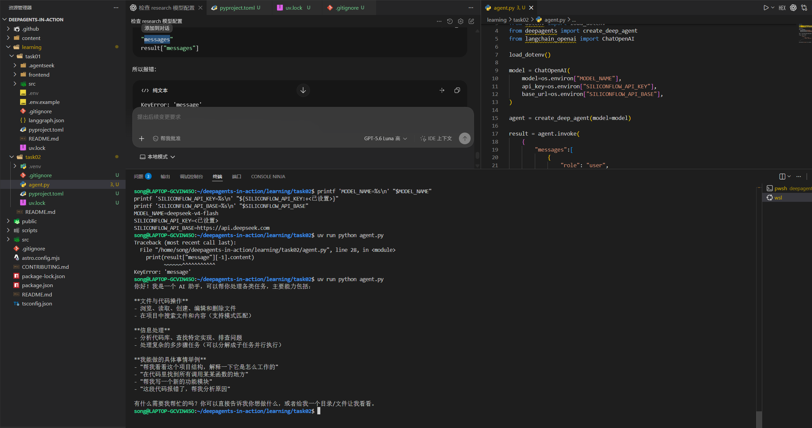
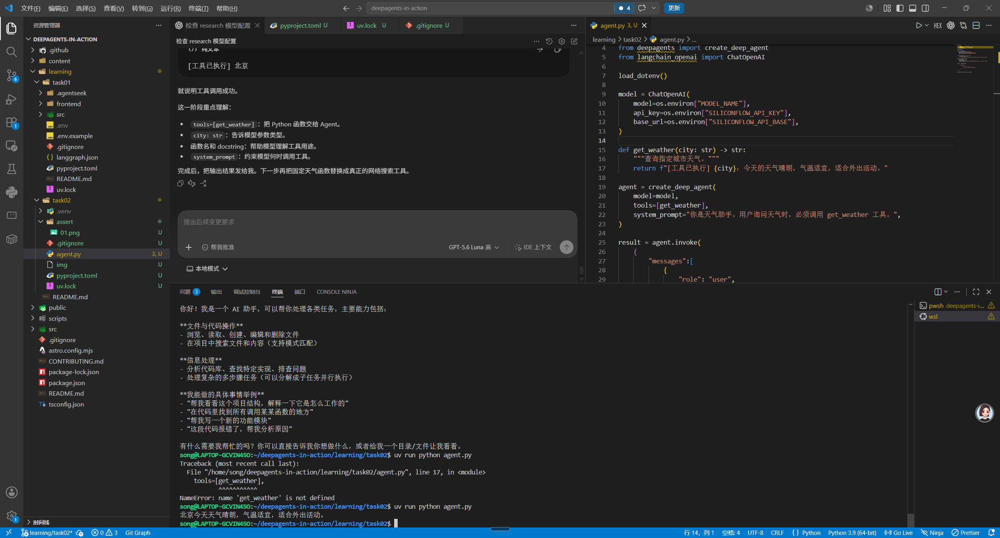
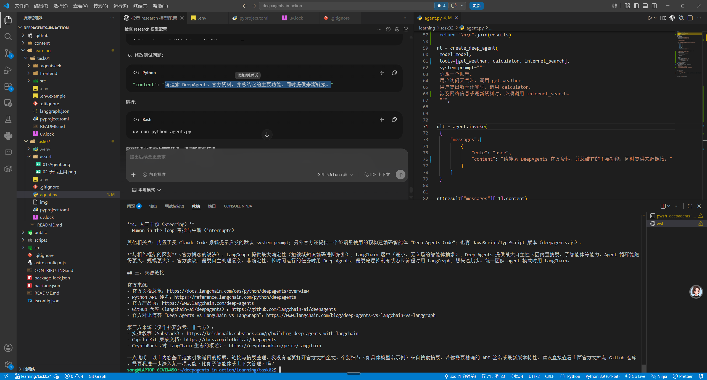
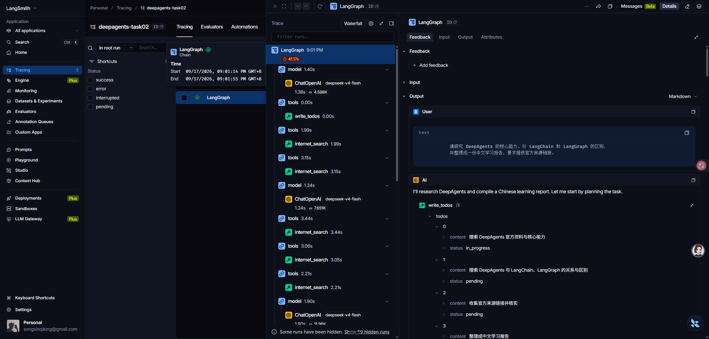

# Task 02 学习记录：DeepAgents 快速上手

## 一、学习目标

本次学习按照课程第二章“快速上手”，从最小 Agent 开始，逐步增加工具调用、网络搜索和任务规划能力。

课程链接：

<https://datawhalechina.github.io/deepagents-in-action/chapters/ch02-quickstart/>

## 二、分支与环境

当前使用独立分支：

~~~text
learning/task02
~~~

task02 与 task01 分开，避免学习过程影响主分支和 task01 代码。

项目使用 uv 管理 Python 环境和依赖：

~~~text
Python >= 3.12
deepagents >= 0.7.15
langchain-openai >= 1.6.2
python-dotenv >= 1.2.3
~~~

运行命令：

~~~bash
uv run python agent.py
~~~

## 三、模型配置

本次使用 DeepSeek 的 OpenAI-compatible 接口，通过临时环境变量配置模型：

~~~text
MODEL_NAME=deepseek-v4-flash
SILICONFLOW_API_KEY=<已设置>
SILICONFLOW_API_BASE=https://api.deepseek.com
~~~

API Key 没有写入本学习记录，也没有提交到 Git。

模型配置流程：

~~~text
环境变量
    ↓
load_dotenv()
    ↓
ChatOpenAI
    ↓
create_deep_agent()
~~~

## 四、创建最小 Agent

首先使用 ChatOpenAI 创建模型，再通过 create_deep_agent(model=model) 创建 Deep Agent，最后使用 agent.invoke() 发送用户消息。

第一次运行遇到错误：

~~~text
KeyError: 'message'
~~~

原因是 LangGraph 的标准消息状态字段是复数 messages，代码却使用了单数 message。修正后，最小 Agent 可以正常运行。

实际执行结果：

~~~text
北京今天天气晴朗，气温适宜，适合外出活动。
~~~

实际运行截图：

## 五、添加天气工具

添加 get_weather(city: str) 工具后，Agent 的执行流程变为：

~~~text
用户提问
    ↓
模型判断需要天气工具
    ↓
调用 get_weather("北京")
    ↓
工具返回天气信息
    ↓
模型整理为自然语言回答
~~~

这一阶段理解了：

- 工具函数可以是普通 Python 函数。
- 参数类型标注帮助模型理解工具参数。
- docstring 帮助模型理解工具用途。
- tools=[get_weather] 将工具注册给 Agent。

实际运行截图：

## 六、添加计算器工具

添加 calculator(a, b, operation) 后，Agent 可以根据用户问题选择计算工具。

测试问题：

~~~text
请计算 123 乘以 45。
~~~

实际执行结果：

~~~text
123 × 45 = **5535**
~~~

验证结果：

~~~text
123 × 45 = 5535
~~~

这一阶段学习了多个参数、参数类型和运算符说明如何影响工具调用。

## 七、添加 Tavily 网络搜索

添加 internet_search(query, max_results) 工具，并配置 TAVILY_API_KEY 后，Agent 可以搜索互联网资料。

执行流程：

~~~text
用户提出研究问题
    ↓
模型调用 internet_search
    ↓
Tavily 搜索互联网
    ↓
返回标题、链接和摘要
    ↓
模型整理研究报告
~~~

测试内容是研究 DeepAgents 的定义、主要能力，以及它与 LangChain、LangGraph 的区别。

实际结果包含 DeepAgents 的定义、主要能力、框架区别、官方文档链接、GitHub 仓库链接和 LangChain 官方博客链接。

验证结果：

~~~text
Tavily 搜索工具执行成功，并生成带来源链接的报告。
~~~

实际运行截图：

## 八、添加 TodoListMiddleware

加入 TodoListMiddleware() 后，Agent 可以在处理复杂问题时维护任务列表。

整体执行流程：

~~~text
用户提出研究问题
    ↓
TodoListMiddleware 创建任务计划
    ↓
模型读取任务计划
    ↓
调用 internet_search
    ↓
更新任务状态
    ↓
继续搜索或整理结果
    ↓
生成最终报告
~~~

这使 Agent 从简单问答升级为“规划—执行—检查—总结”的任务执行流程。

## 九、当前验证结果

~~~text
模型配置：成功
Deep Agent 创建：成功
天气工具：成功
计算器工具：成功，123 × 45 = 5535
Tavily 搜索：成功
研究报告生成：成功
TodoListMiddleware：已加入并成功产生结果
~~~

## 十、LangSmith 记录

目前已经了解 LangSmith 的配置方式和查询命令，但还没有拿到具体 trace 层级输出，因此暂时不记录具体节点数量。

实际运行截图：

预计可以观察到类似的执行结构：

~~~text
Agent
├── model
│   └── ChatOpenAI
├── tools
│   └── internet_search
├── model
│   └── ChatOpenAI
└── 最终输出
~~~

其中：

- ChatOpenAI：实际调用 DeepSeek 模型。
- internet_search：实际调用 Tavily。
- TodoListMiddleware：维护任务计划和任务状态。
- 多组 model → tools → model：表示 Agent 根据工具结果继续推理。

## 十一、学习总结

本次 task02 从最小 Agent 开始，逐步增加了工具、网络搜索和任务规划能力。核心理解是：

~~~text
模型负责理解和决策
工具负责执行具体动作
Middleware 负责扩展 Agent 的执行能力
LangGraph 负责组织整个执行流程
~~~

与 task01 相比，task02 更关注 Deep Agent 的基础构建过程，而不是直接使用一个已经组织好的 research 项目。
